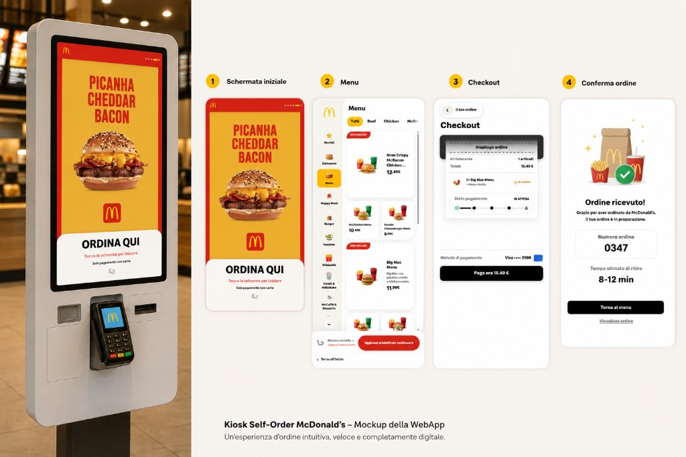
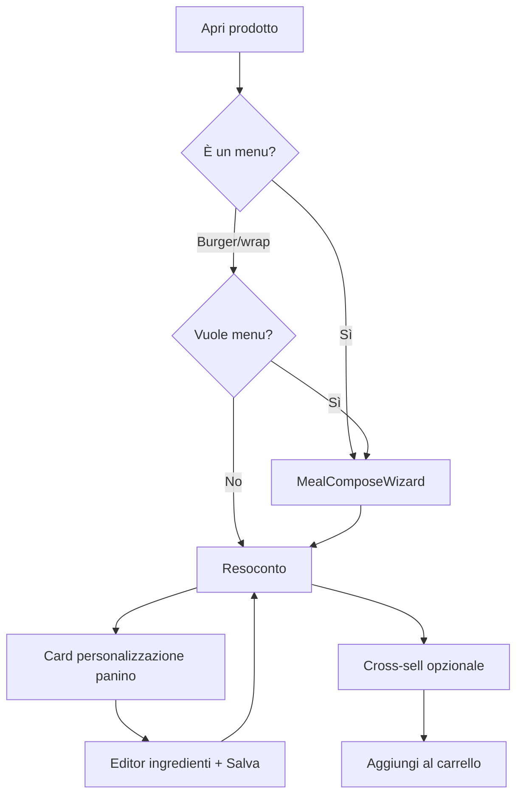

# McDonald's Self-Order Kiosk — WebApp Demo

Mockup interattivo di un **kiosk self-order** in stile McDonald's: esperienza d'ordine touch-first, veloce e completamente digitale, pensata per schermi verticali in ristorante.

<p align="center">
  
</p>

<p align="center">
  <em>Kiosk Self-Order McDonald's — Mockup della WebApp. Un'esperienza d'ordine intuitiva, veloce e completamente digitale.</em>
</p>

---

## Panoramica

Progetto **demo / portfolio** che simula il percorso completo di un cliente al kiosk:

1. **Attract loop** — video promozionali e CTA *Ordina qui*
2. **Start** — scelta *Al ristorante* / *Asporto* + lingua
3. **Menu** — navigazione per categorie, filtri, griglia prodotti bento
4. **Prodotto** — wizard menu, personalizzazione panino, cross-sell, resoconto ordine
5. **Carrello** — righe ordine con meta (menu, patatine, bibita, extra), quantità, codici promo
6. **Checkout** — riepilogo ricevuta, stato pagamento simulato
7. **Conferma** — numero ordine, orario ritiro, snapshot ordine, nuova sessione

L'interfaccia replica il design system McDonald's (crema, rosso, oro, tipografia Speedee) con **polish da produzione**: touch target 44px+, microinterazioni tattili, transizioni leggere e layout ottimizzato per kiosk.

> **Nota:** progetto dimostrativo. Non affiliato a McDonald's Corporation. Brand e asset usati a scopo illustrativo.

---

## Tech stack

| Area | Tecnologia |
|------|------------|
| **Runtime** | [React 19](https://react.dev/) |
| **Build** | [Vite 8](https://vite.dev/) |
| **Routing** | [React Router 7](https://reactrouter.com/) |
| **Animazioni** | [Framer Motion 12](https://www.framer.com/motion/) |
| **Scroll** | [Lenis](https://lenis.darkroom.engineering/) (aree scrollabili fluide) |
| **Icone** | [Lucide React](https://lucide.dev/) |
| **Styling** | CSS modulare per schermata + design tokens (`:root`) |
| **Utilità** | `clsx`, `tailwind-merge` |
| **Lint** | ESLint 10 + React Hooks |

**Non incluso (by design):** backend, database, pagamenti reali, PWA — tutto gira in-memory nel browser.

---

## Funzionalità principali

### Esperienza kiosk

- **Viewport kiosk** — shell 480px, `100dvh`, angoli arrotondati e ombra da terminale fisico
- **Touch-first** — `touch-action: manipulation`, target minimo 44px, feedback `:active` su card e CTA
- **Idle timeout** — dopo 2 min di inattività: avviso, countdown 60s, reset sessione e ritorno allo schermo promo
- **Scroll orizzontale** — pill filtri e carousel cross-sell trascinabili (`useHorizontalDragScroll`)
- **Scroll verticale** — griglia menu e contenuti prodotto con Lenis + elastic scroll dove serve
- **Credit design** — link *Design by Michel Branche* nell’app shell

### Menu e catalogo

- **9+ categorie** — Novità, Menu, Happy Meal, Burgers, Salads, Sfiziosità, Gelati, McCaffè, Drinks, …
- **Filtri pill** — configurabili per categoria (Beef, Chicken, tag vegetariano, …)
- **Layout bento** — card `default`, `featured` (2×2) e `wide` (banner) con badge Bestseller / Novità
- **McCaffè** — sottogriglia per sottocategorie (caffè, dolci, …)
- **i18n** — Italiano, English, Français, Español, Deutsch (stringhe centralizzate in `i18n.js`)

### Wizard composizione menu (`MealComposeWizard`)

Flusso a **4 step** prima della personalizzazione e dell’aggiunta al carrello (prodotti `type: meal`, o burger/wrap con upgrade menu):

| Step | Contenuto |
|------|-----------|
| 1. Taglia | Menu Medio / Menu Grande (+€1 su menu già “menu” in catalogo) |
| 2. Patatine | Tutte le varianti con tag `fries`; **supplemento** se diverse da quelle incluse (Medie nel Medio, Grandi nel Grande) |
| 3. Bibita | Catalogo bevande con immagine |
| 4. Extra | Salvaeuro + Sfiziosità (multi-selezione, senza sì/no) |

- Barra riepilogo: taglia · patatine · bibita · conteggio extra
- Link grigio **Annulla e torna al menu** sotto ogni CTA *Continua*
- Extra scelti nel wizard → righe `pendingCrossSells` sul resoconto prodotto

### Prodotto, personalizzazione e cross-sell

**Resoconto ordine** (dopo wizard sui menu):

- Riepilogo composizione menu in fascia
- Sezione **Personalizza il tuo ordine** — card orizzontali con icona prodotto (panino collegato al menu, es. McChicken Menu → McChicken)
- Carousel **Che ne dici di qualcosa in più?** — visibile sul resoconto (nascosto solo durante il wizard aperto)
- Bottom bar a **2 righe**: pulsante Menu + riga quantità / **Aggiungi al carrello** con prezzo formattato (`10.49 €`)

**Flusso personalizzazione panino:**

1. Tap sulla card → editor ingredienti (contatori +/-)
2. **Salva** → torna al resoconto (badge *Modificato* se diverso dal default)
3. **Aggiungi al carrello** — totale include extra, upgrade menu, supplemento patatine, cross-sell in sospeso

**Regole extra:**

- Ingredienti panino (formaggio, pomodoro, cipolla, salsa Big Mac, …) solo su **burger** e **wrap**
- Menu, bibite, dolci, milkshake **non** ereditano gli extra del panino
- Profili dedicati per insalate, Happy Meal e alcuni side (`extrasKey` in `data.js`)

**Cross-sell:**

- Carousel con auto-scroll, selezione multipla, modale quantità
- Personalizzazione ingredienti dal resoconto (card), non più nel modale cross-sell

### Carrello e righe ordine

- **Carrello globale** — `KioskContext`: add / update / remove, conteggio badge, totali
- **Righe composte** — `menuCombo` (patatine, bibita, `friesSurcharge`), `mealUpgrade`, extra con conteggio
- **Meta leggibili** — `utils/orderLine.js`: titolo `Nome x qty`, sottorighe menu/patatine/bibita/extra
- **Promo code** — `MCD10` (−10%), `MAC5` (−5€) con messaggi successo/errore
- **Prezzi** — `Price` + `formatPriceButton` / `splitPrice` per CTA e totali

### Checkout e conferma ordine

- **Riepilogo ricevuta** — slot macchina, lista righe con thumbnail e meta, totale e sconto
- **Pagamento simulato** — barra progresso a 5 step, animazione ~2.4s, tag *In attesa* → *Pagato*
- **Snapshot ordine** — `lastOrderSnapshot` in context al `completeOrder()` per la schermata successiva
- **Conferma ordine** — hero, *Ordine ricevuto!*, card numero ordine a 4 cifre, fascia orario ritiro, CTA *Nuova sessione* / *Visualizza ordine*, tipo dine-in / asporto

### UI polish (production-ready)

- Design tokens condivisi: ombre, easing, durate, `--touch-min`
- Transizioni pagina (`pageFade`, `pageSlide` via `utils/motion.js`)
- Animazione quantità e badge carrello al cambio valore
- `prefers-reduced-motion` — hover transform disabilitati dove appropriato

---

## Flusso schermate

```
/  Promo              → video loop, tap per iniziare
/start               → dine-in / asporto, lingua
/menu                → sidebar + griglia + dock carrello
/product/:id         → wizard menu (se meal) → resoconto → personalizza → carrello
/cart                → righe con meta, promo, totali
/checkout            → ricevuta + paga ora (simulato)
/order-complete      → numero ordine, snapshot, nuova sessione
```

### Flusso prodotto (semplificato)



---

## Struttura progetto

```
demo-kiosk1/
├── docs/
│   └── preview.png              # Mockup marketing / README
├── public/
│   ├── brand/                   # Logo, icone categorie, hero conferma ordine
│   ├── flags/                   # Bandiere lingue
│   ├── products/                # Immagini prodotti
│   └── promos/                  # Video schermata attract
├── src/
│   ├── components/
│   │   ├── MealComposeWizard.jsx   # Wizard menu 4 step
│   │   ├── OrderCompleteHero.jsx
│   │   ├── McLogo, DockCartIcon, IdleTimeoutGuard, …
│   ├── context/                 # KioskContext (+ snapshot ordine), LenisContext
│   ├── hooks/                   # drag scroll, elastic scroll, grid scroll, cross-sell auto-scroll
│   ├── screens/                 # Promo, Start, Menu, Product, Cart, Checkout, OrderComplete
│   ├── utils/
│   │   ├── mealFries.js         # Patatine incluse + supplemento per taglia menu
│   │   ├── personalise.js       # Unità personalizzabili (menu → panino)
│   │   ├── productExtras.js     # Init / resolve extra per prodotto
│   │   ├── orderLine.js         # Titoli e meta righe carrello / conferma
│   │   ├── crossSell.js         # Loop carousel + extra wizard menu
│   │   ├── price.js, motion.js, filters.js, menuLayout.js
│   ├── data.js                  # Catalogo, mealUpgradeOptions, getPersonalizationProduct
│   ├── i18n.js                  # Traduzioni 5 lingue (wizard, personalizza, conferma)
│   └── App.jsx                  # Router, app-shell, AnimatePresence
└── package.json
```

---

## Avvio rapido

### Requisiti

- **Node.js** 18+ (consigliato 20+)
- **npm** 9+

### Installazione

```bash
git clone <repository-url>
cd demo-kiosk1
npm install
```

### Sviluppo

```bash
npm run dev
```

Apri l'URL locale (es. `http://localhost:5173`). Per un'esperienza fedele al kiosk, usa DevTools in modalità **responsive** con larghezza ~480px e touch emulation.

### Build produzione

```bash
npm run build
npm run preview
```

### Lint

```bash
npm run lint
```

---

## Codici promo demo

| Codice | Effetto |
|--------|---------|
| `MCD10` | Sconto 10% sul subtotale |
| `MAC5` | Sconto fisso 5 € |

---

## Personalizzazione

| File | Cosa modificare |
|------|-----------------|
| `src/data.js` | Prodotti, categorie, pill, prezzi, `MEAL_SANDWICH_NAME_MAP`, supplemento Menu Grande |
| `src/i18n.js` | Testi UI, wizard menu, personalizzazione, conferma ordine |
| `src/index.css` | Token colore, radius, touch, ombre |
| `src/context/KioskContext.jsx` | Carrello, promo, snapshot ordine, reset sessione |
| `src/components/MealComposeWizard.jsx` | Step wizard e UI composizione menu |
| `src/utils/mealFries.js` | ID patatine incluse per Menu Medio / Grande |
| `public/promos/` | Video schermata iniziale |
| `public/brand/order-complete-hero.png` | Hero schermata conferma |

---

## Licenza e disclaimer

Progetto **dimostrativo / educativo**. McDonald's®, Golden Arches® e asset correlati sono marchi dei rispettivi proprietari. Nessuna affiliazione o endorsement implicito.

---

## Autore

Sviluppato come **case study frontend** su UX kiosk, design system fedele al brand e qualità d'implementazione da produzione.

**Design:** [Michel Branche](https://www.michelbranche.it)

Per domande o collaborazioni, contattami su [LinkedIn](https://www.linkedin.com/).
